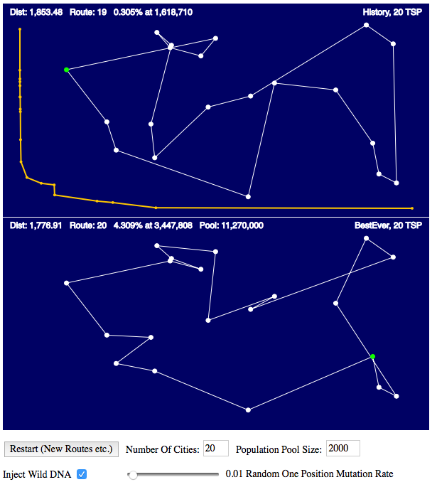
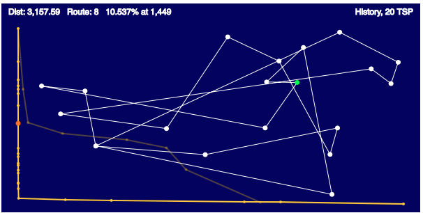
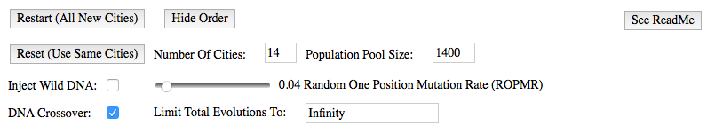

## 03_TSP_GA_CROSSOVER_AKS

A Variation to Daniel Shiffman's 03_TSP_GA_Crossover in
Nature of Code: Intelligence and Learning
https://github.com/shiffman/NOC-S17-2-Intelligence-Learning.

This program develops solutions to the "Traveling Salesperson Problem" (TSP) using a genetic algorithm (GA) method. In the TSP there is a given set of "cities". The task is to find the shortest travel distance routing where the salesperson visits each city once, eventually returning to the starting city. The GA method maintains a population of routings that are initially chosen at random but then subsequently evolved from previous "better fitting" routings into newer populations. The evolution uses methods that attempt to emulate simple "genetic" reproduction while also introducing random changes.

What is seen on the screen is a set of dots connected with lines. The dots represent the cities. The lines represent the route traveled from one town to the next.

From a biology viewpoint, the observer should abstract the salesperson routing solutions as representing different evolutionary stages to an organism that evolves in an environment where having a lower distance traveled is an advantage.

The GA reproduction method in this program is crude compared to real life, but in its operation it does exhibit some evolution characteristics. This program is designed for someone to observe how the simple GA evolution proceeds in context with the TSP complexity, mutation rate and genetic population size. The observer can then recognize basic evolution concepts.

[Demo](https://akseidel.github.io/03_TSP_GA_CROSSOVER_AKS/)

The following image shows the program in operation on a 20 city TSP routing. The canvas is divided into two sections top and bottom. The top section shows the previous "organisms". The bottom section shows the current "organism". Below the canvas are the program's control elements.

**Bottom Section** &mdash; The current organism shown in the bottom section is the 20th organism's evolved state. Each evolved state is when the route distance evolves to be smaller than the previous evolved distance. The 20th route distance is 1,776.91.

That 1,776.91 distance is a 4.309% change from the previous 19th organism's distance. The evolution to the 20th state occurred with the 3,446,808th organism.

"Pool: 11,270,000" indicates the first member in the current population pool of 2000 members is the 11,270,000th organism when this image was captured. This number increases by the population pool size with each new population pool generation. Incidentally, this batch evolved to the 22th organism at the time of this writing. The 22th change occurred at the 22,655,444 organism. The 21st evolution occurred at 12,194,103.

**Top Section** &mdash; The top section shows the previous evolved state. This is the evolved state that the current evolved state bettered with a smaller distance. That previous 19th state occurred with the 1,618,710th organism and was a 0.305% "improvement" over the 18th state.

The yellow curve in the top section represents the traveling distances for all the historical previous evolved states. The horizontal axis is the Nth member that possessed better minimum distance and the vertical axis represents the traveling distance. The small dots in curve are at each new state. This yellow curve is in essence an evolution time line showing how significant each change is relative to the **_past changes_**.

The routes and data for all the previous evolved states will be displayed when the mouse is moved horizontally across the top section. Two history curves appear when displaying evolution history prior to the second to last evolution state.

One is the total history curve and the paler, thinner yellow curve represents the evolution history **_up to the displayed historical state_**. Look at the "Route:" number when moving the mouse sideways on the top section to navigate the evolution history. The larger node on the total history curve shows where the displayed route occurs in the total history curve.

**The Controls**

* Button &ndash; **Restart(All New Cities)**
  - Restarts the evolution for a new set of cities from scratch using the control settings indicated.
* Button &ndash; **Reset(Use Same Cities)**
  - Restarts the evolution with the same set of cities from scratch using the control settings indicated.
* Input &ndash; **Number Of Cities**
  - Sets the number of cities. This number must be 4 or larger.
* Input &ndash; **Population Pool Size**
  - The population size for the pool of travel route orders (i.e. organisms) upon which the GA reproduction is performed. Each member in the pool will be evaluated for distance and judged based upon distance. The pool is constantly being regenerated from members selected from the previous pool.
  - The population size can be changed on the fly. You must press the enter (return) key after making a population size change or you must move the pointer focus out of the population size edit box in order for the change to register.
* Checkbox &ndash; **Inject Wild DNA:**
  - When checked, one of the travel route order members used in the travel route order crossovers used to generate _one_ member of next generation travel route pools will be "totally wild". Its cities order will be a random travel order arrangement instead of being a travel order selected from the judged "evolved" pool normally used in the simulated reproduction algorithm. The injection happens prior to crossover.
* Slider &ndash; **Random One Position Mutation Rate**
  - Sets the rate (i.e. probability) that one pair of cities will be swapped in the route order of each population pool member.
* Checkbox &ndash; **DNA Crossover:**
  - The GA reproduction does a simple DNA crossover when generating the next members.
  - The single wild DNA can still occur if checked when crossovers are not to occur.
* Input &ndash; **Limit Total Evolutions To:**
  - Set a stopping point. The default value is Infinity. The number placed here is the number of routes generated where the process stops.
  - You can use this input to halt the process. Type in a 1 or any number smaller than the current pool count. The generation process stops but the history section UI still functions. Type in a -1 to pick up the process where it had been halted. The Infinity value will be entered for you.

**The Genetic Algorithm (GA)**

* A population of travel order routes is graded by total travel distance. That travel distance is normalized over the population and stored as a fitness property for each member in the population pool. The population is then sorted by its fitness value.
  * Because the fitness property is normalized to be a value from 0 to 1, a random number generated between 0 and 1 can be mapped into the normalized fitness properties in a way that favors one side of the normalization. A method based on that principle is used to select from the population when reproducing for the next generation. The effect tends to select the better fitness members.
* A new population of travel order routes is created by combining pieces of a pair of order routes selected using the better fitting members selection method.
  * The piece combination process is a mock crossover method where positions in one travel order pair are selected at random to mark where the route order is deleted. The route order collapses around the deleted section. The missing cities are then selected from the start of the other travel order, ignoring any cities that are already present in the new route order.
  * The **Inject Wild DNA** option uses one random route routing for one of the crossover pairs when creating one of the next population pools.
* After crossover, each population pool route order member is subjected to the chance that one of its route cities will be swapped with another one of its route cities. The chance that this happens is controlled by the **Random One Position Mutation Rate**.
    * At this point the new population has been created. It is ready to be evaluated for fitness.
    * Each pool member is checked to see if it will become a new best fitness qualifier.
